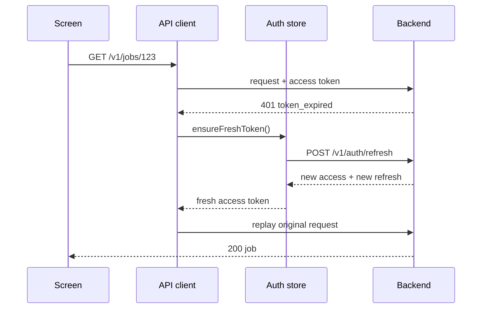
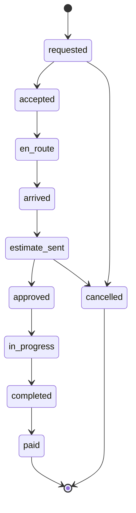
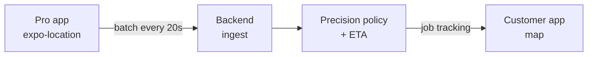

# Pynaro Mobile: Technical Architecture Plan

The mobile app ships two roles, customer and technician, on Expo Router with
role-scoped route groups, TanStack Query as the only server-state store, and
types generated from the backend's OpenAPI document. The backend contract is
the critical path: the decisions in section 11 need agreement before screen
work starts.

While there is no backend, an in-process mock adapter stands in behind the same
interface. See `docs/implementation-plan.md`.

## 1. React Native + Expo architecture

A custom dev client from day one. `react-native-maps` and background location
both need native code, so there is no phase where the team runs on Expo Go.

- **Runtime:** latest Expo SDK, New Architecture on, Hermes. Turning the New
  Architecture on later is a migration, so start with it.
- **Build:** `expo-dev-client` locally, EAS Build for all three profiles, EAS
  Update for JS-only fixes.
- **TypeScript:** `strict` plus `noUncheckedIndexedAccess`. No `any` in `src/api`.
- **Styling:** one theme module holding tokens ported from the prototype's CSS
  variables, consumed through `StyleSheet.create`. No Tailwind port and no
  runtime CSS-in-JS, both cost more than they return here.
- **Navigation:** Expo Router only, no hand-written React Navigation config
  alongside it.
- **Forms:** `react-hook-form` with `zod` resolvers.
- **Lists:** FlashList for jobs, messages and provider lists. FlatList elsewhere.
- **Errors:** one error boundary per route group, plus Sentry with source maps
  uploaded from EAS.

Single app repo, not a monorepo. The only artifact shared with the dashboard
and backend is the OpenAPI document, and a package registry is a heavier answer
than that needs.

**Needs agreement:** the backend publishes an OpenAPI 3.1 document at a stable
per-environment URL. Everything in section 3 depends on it.

## 2. Route structure and role-based protection

Three top-level groups, one per audience. The root layout reads the session and
redirects once; each group's layout then guards its own subtree, so a deep link
into the wrong group cannot render even for a frame.

```
app/
  _layout.tsx                  providers + session gate + splash hold
  (auth)/
    _layout.tsx                redirect out if already signed in
    welcome.tsx  sign-in.tsx  sign-up.tsx  permissions.tsx
  (customer)/
    _layout.tsx                requires role === "customer"
    (tabs)/
      _layout.tsx              home · map · bookings · messages · account
      index.tsx  map.tsx  bookings.tsx  messages.tsx  account.tsx
    request/
      _layout.tsx              wizard stack, holds the draft store
      service.tsx  details.tsx  address.tsx  provider.tsx  review.tsx
    job/[id].tsx
    provider/[id].tsx
    chat/[jobId].tsx
  (pro)/
    _layout.tsx                requires role === "technician"
    (tabs)/
      _layout.tsx              dashboard · requests · jobs · earnings
      index.tsx  requests.tsx  jobs.tsx  earnings.tsx
    job/[id].tsx
    estimate/[jobId].tsx       modal presentation
  +not-found.tsx
```

**How the gate works.** The root layout keeps the native splash up while the
session hydrates from SecureStore, so there is no flash of the wrong group.
Once `status` is known it is `signed-out`, `customer` or `technician`, and the
layout renders `<Redirect>` accordingly. Each group layout repeats the check
rather than trusting the parent, because Expo Router keeps mounted screens
alive across redirects.

**Role comes from the server, never from the client.** The prototype's role
picker is a demo control and does not ship.

**The request wizard** is a stack, not five screens pushing a shared global.
Its `_layout.tsx` owns a draft store scoped to that stack, so backing out of
the flow disposes the draft with the layout.

**Needs agreement:** one account per role or both on one account; role as a
token claim or from `/me`; the universal link domain and Android app links.

## 3. API client and generated types

Types are generated from the backend's OpenAPI document and committed. Nobody
hand-writes a DTO, and a breaking backend change shows up as a TypeScript error
rather than a runtime crash.

**Toolchain:** `openapi-typescript` for the schema and `openapi-fetch` for the
client. Roughly 6 kB at runtime, fully typed paths and bodies, and no generated
hooks.

**Pipeline:** `pnpm api:generate` pulls the staging spec into
`src/api/schema.d.ts`, which is committed. CI regenerates and fails if the diff
is non-empty.

**Four layers, one direction:**

1. `schema.d.ts` — generated, never edited.
2. `client.ts` — one `openapi-fetch` instance, base URL from config, middleware
   for auth, trace id and error normalisation.
3. `src/api/*.ts` — thin typed functions per resource.
4. Feature hooks — written by hand over TanStack Query.

The prototype's single `/api/pynaro` endpoint with an `action` field does not
survive. It cannot be described usefully in OpenAPI, cannot be cached per
resource, and gives every call the same failure surface.

**Wire conventions to fix now:**

| Concern    | Proposal                                                                       |
| ---------- | ------------------------------------------------------------------------------ |
| Versioning | `/v1` path prefix                                                              |
| Money      | integer minor units plus an ISO 4217 `currency` field                          |
| Dates      | ISO 8601 with offset, UTC on the wire                                          |
| Errors     | one envelope with a stable machine `code`, a human `message`, optional `field` |
| Lists      | cursor pagination, `?cursor=&limit=` returning `{ data, nextCursor }`          |
| Writes     | `Idempotency-Key` on job creation, estimate approval and payment               |
| Tracing    | client sends `X-Request-Id`, backend echoes it into logs                       |

## 4. Server state vs client state

One rule decides every case: if the server owns the value, it lives in TanStack
Query and nowhere else. If only this device knows it, it lives in a small
client store. Nothing is copied from a query into a store.

**TanStack Query owns** the catalog, live availability, the job list, each
job's detail, earnings, platform settings and `/me`. **Client stores own** the
session, the request-wizard draft and map UI state. Three Zustand stores, none
of them large, no Redux.

**Persisted on device:** tokens in SecureStore, onboarding completion and
last-used address in AsyncStorage. No job data is cached to disk.

**Query key factory** in `src/api/keys.ts`:

```
jobs.all              ['jobs']
jobs.list(filters)    ['jobs', 'list', filters]
jobs.detail(id)       ['jobs', 'detail', id]
catalog.categories    ['catalog', 'categories']
availability(near)    ['availability', near]
```

| Query                         | staleTime | Refetch behaviour                               |
| ----------------------------- | --------- | ----------------------------------------------- |
| Categories, businesses        | 24 h      | on app start                                    |
| Platform settings             | 1 h       | on app start                                    |
| Nearby availability           | 15 s      | poll 15 s while the map screen is focused       |
| Job list                      | 30 s      | on focus                                        |
| Job detail, active            | 10 s      | poll 10 s while not terminal, on focus, on push |
| Job detail, paid or cancelled | infinite  | never                                           |
| Earnings                      | 5 min     | on focus                                        |

**Mutations write through, they do not guess.** Every job mutation returns the
full updated job; the app seeds `jobs.detail(id)` from the response and
invalidates `jobs.all`. No optimistic update on job status, because the server
owns the state machine and an optimistic transition the server rejects leaves
the customer looking at a lie.

**Offline** is handled with retry and clear empty states, not a full offline
mode. Wire `onlineManager` to NetInfo so queries resume on reconnect, and let
mutations fail loudly rather than queueing.

## 5. Authentication and token refresh

Short-lived access token, long-lived rotating refresh token, and one refresh in
flight at a time. The prototype offers email, Apple and Google, so all three
ship; Apple is mandatory on iOS once Google is there.

**Storage.** The access token lives in memory and is mirrored to SecureStore.
The refresh token lives only in SecureStore, `WHEN_UNLOCKED_THIS_DEVICE_ONLY`,
and never reaches a log or Sentry breadcrumb.

**Refresh is single-flight.** The client middleware holds one shared refresh
promise. Ten concurrent 401s wait on that one promise and replay once, instead
of firing ten refreshes and tripping reuse detection.



A failed refresh is terminal: clear the session, clear the query cache,
redirect to `(auth)`. The app never retries a refresh.

**Logout** revokes the refresh token server-side, deletes the push token
registration, clears SecureStore and calls `queryClient.clear()`.

## 6. Job state machine

The server owns the machine. The app never sends a target status; it sends an
intent, and the backend decides whether that intent is legal from the current
state and the caller's role.



| From          | Actor                           | Intent endpoint                    | To            |
| ------------- | ------------------------------- | ---------------------------------- | ------------- |
| requested     | technician or dispatcher        | `POST /jobs/{id}/accept`           | accepted      |
| requested     | customer, or the response timer | `POST /jobs/{id}/cancel`           | cancelled     |
| accepted      | technician                      | `POST /jobs/{id}/depart`           | en_route      |
| en_route      | technician                      | `POST /jobs/{id}/arrive`           | arrived       |
| arrived       | technician                      | `POST /jobs/{id}/estimate`         | estimate_sent |
| estimate_sent | customer                        | `POST /jobs/{id}/estimate/approve` | approved      |
| estimate_sent | customer                        | `POST /jobs/{id}/estimate/decline` | cancelled     |
| approved      | technician                      | `POST /jobs/{id}/start`            | in_progress   |
| in_progress   | technician                      | `POST /jobs/{id}/complete`         | completed     |
| completed     | customer                        | `POST /jobs/{id}/pay`              | paid          |

The prototype instead accepts `{ action: "update_job", status: "paid" }` from
anyone. That is fine for a demo and unacceptable in production: a customer
could mark their own job paid without a charge.

**In the app.** `src/domain/jobTransitions.ts` holds the same table and answers
one question: given this status and this role, which action does the screen
offer? It drives affordances only. The server stays the authority.

**Conflicts are expected,** not exceptional. The backend answers `409` with the
job's current state; the client replaces its cache with that state, re-renders
and tells the user the job moved on.

**Polling stops** at `paid` and `cancelled`.

**The response window is a server concern.** The prototype counts down in the
UI and does nothing when it hits zero. In production the backend expires an
unanswered request and emits the transition; the app renders `expiresAt` from
the job payload.

## 7. Technician live location

The technician app produces points, the backend owns precision and ETA, and the
customer app consumes a job-scoped view. The customer never receives a raw
position the backend has not already decided they may see.



**Producing.** Foreground updates while the technician is on shift. Background
updates only between `accepted` and `completed` on an active job, never all
day. `expo-task-manager` defines the task at module scope,
`startLocationUpdatesAsync` runs with a 50 m distance filter and a 15 s floor,
and the task stops the moment the job reaches a terminal state.

Permissions are asked for in context. iOS "Always" is requested when the
technician accepts their first job, behind a screen that explains why. Android
needs `FOREGROUND_SERVICE_LOCATION` and the persistent notification that
`expo-location`'s `foregroundService` option provides.

**Batching.** Points buffer locally and POST as an array every 20 to 30
seconds. The buffer is capped, oldest points drop first.

**Consuming.** The customer app polls `GET /v1/jobs/{id}/tracking` every 10
seconds while the job is `en_route`, and stops otherwise. Sockets are a later
optimisation.

**Privacy is enforced server-side.** Before acceptance the tracking endpoint
returns a coarse position only, snapped to a grid. The app must never receive a
precise point it is then trusted to hide.

**Rendering.** Markers interpolate between received points so they glide rather
than jump. Interpolation is presentation only.

## 8. Push notifications

`expo-notifications` with Expo's push service for v1. The backend posts to
Expo's API rather than holding APNs certificates and FCM credentials.

**Token lifecycle.** The app registers a token on sign-in, on every app start
where the token has changed, and on `addPushTokenListener`. It deletes the
registration on logout. A record is
`{ token, platform, role, deviceId, appVersion }`.

**Payload contract.** Every push carries a `data` object the app can act on
without parsing display text:

```json
{ "type": "job.estimate_sent", "jobId": "...", "route": "/job/abc123", "v": 1 }
```

| Event                          | Recipient              | Opens             |
| ------------------------------ | ---------------------- | ----------------- |
| `job.requested`                | technician, dispatcher | `/(pro)/requests` |
| `job.accepted`                 | customer               | `/job/{id}`       |
| `job.en_route`                 | customer               | `/job/{id}`       |
| `job.arrived`                  | customer               | `/job/{id}`       |
| `job.estimate_sent`            | customer               | `/job/{id}`       |
| `job.estimate_approved`        | technician             | `/(pro)/job/{id}` |
| `job.completed`                | customer               | `/job/{id}`       |
| `job.paid`                     | technician             | `/(pro)/earnings` |
| `job.expired`, `job.cancelled` | both                   | `/job/{id}`       |
| `message.received`             | both                   | `/chat/{jobId}`   |

**Three ways a push arrives, three handlers.** In the foreground the app shows
an in-app banner and invalidates the named job queries. From the background,
the tap handler routes to `data.route`. On a cold start the app calls
`getLastNotificationResponseAsync` before the first navigation and holds the
splash.

Every push invalidates the queries it names. That is what lets the polling
intervals stay relaxed rather than aggressive.

**Android channels:** `jobs-urgent` with high importance and sound for
emergency offers, `jobs` default, `messages` default. iOS uses the
time-sensitive interruption level for emergency job offers only.

## 9. Payments and the Stripe boundary

The app collects consent and renders amounts. It never computes an amount,
never holds a secret key, and never touches card data.

**What the app does, in full:**

1. Asks the backend for a SetupIntent client secret and presents Stripe's
   PaymentSheet in setup mode to save a card.
2. Sends the job request. The backend creates the PaymentIntent.
3. If the backend says authentication is required, calls `handleNextAction`.
4. Sends `approve`, `pay` and a tip **amount**, never a total.
5. Renders the amounts and the card's last four, both from the backend.

**Money model from the prototype.** The customer authorises a card at request
time, the service-call fee is fixed per business, the estimate is approved
before work, and the total is charged at completion as estimate plus service
call plus tip. The platform keeps `feePercent` of the pre-tip total. That maps
to Stripe Connect with an application fee.

**Technician and business payout onboarding stays out of the mobile app.**
Connect onboarding is identity verification, bank details and tax forms. Put it
in the Next.js dashboard.

**Store policy.** These are real-world services, so Apple and Google both
permit outside payment and neither requires in-app purchase.

## 10. Environments and releases

| Environment | Bundle id               | Stripe | Distribution              | Update channel |
| ----------- | ----------------------- | ------ | ------------------------- | -------------- |
| Development | `co.pynaro.app.dev`     | test   | dev client, local         | none           |
| Staging     | `co.pynaro.app.staging` | test   | TestFlight, Play internal | `staging`      |
| Production  | `co.pynaro.app`         | live   | App Store, Play           | `production`   |

**Config.** `app.config.ts` switches on an `APP_VARIANT` environment variable
and sets the name, bundle id, URL scheme and a badged icon. Runtime values
reach the app through `expo-constants` `extra`, never `process.env` at runtime.
Only three values ship in the bundle: the API base URL, the Stripe publishable
key and the Sentry DSN.

**Updates.** EAS Update channels match the profiles, with `runtimeVersion` on
the fingerprint policy. A native dependency change moves the fingerprint and
therefore needs a build.

**CI.** On every pull request: typecheck, lint, unit tests and the
`api:generate` no-diff check. On merge to `main`: an EAS staging build. On a
version tag: a production build and submit.

## 11. Decisions for the backend developer

The first six block all screen work. The rest can be settled while the shell
and the design system are built.

| #   | Decision                                                   | §    | Proposal                                 | Blocks                     |
| --- | ---------------------------------------------------------- | ---- | ---------------------------------------- | -------------------------- |
| 1   | OpenAPI 3.1 document per environment, current in CI        | 3    | yes, it is the contract                  | everything                 |
| 2   | REST resources replace the single `action` endpoint        | 3    | yes                                      | everything                 |
| 3   | Error envelope with a stable machine `code`                | 3    | `{ code, message, field? }`              | error handling everywhere  |
| 4   | Intent endpoints instead of a client-set status            | 6    | yes, server owns the machine             | job screens, pro app       |
| 5   | One account per role, or one account holding both          | 2    | separate accounts for v1                 | route gates, sign-up       |
| 6   | Role in the token claim or from `/me`                      | 2    | claim                                    | cold start, route gates    |
| 7   | Mutations return the full job; `409` carries current state | 4, 6 | yes                                      | caching, conflict handling |
| 8   | Who expires the response window, and into which state      | 6    | backend, into `expired`                  | request flow, timers       |
| 9   | Declining an estimate: cancel, or back to `arrived`        | 6    | back to `arrived`                        | job screen                 |
| 10  | Catalog served by the API, not compiled into the app       | 3    | API, with ETag                           | home, request flow         |
| 11  | Token lifetimes and refresh rotation                       | 5    | 15 min / 60 day sliding, rotating        | auth                       |
| 12  | Location ingest shape and accepted rate                    | 7    | batched array every 20 s                 | pro app                    |
| 13  | ETA computed server-side via a routing provider            | 7    | yes, one billed key, cached              | map, job tracking          |
| 14  | Coarse-location rule before acceptance                     | 7    | server-side grid snap                    | map, privacy claim         |
| 15  | Push event `type` list and who builds `route`              | 8    | list agreed, backend builds `route`      | notifications              |
| 16  | Stripe Connect model and who is merchant of record         | 9    | destination charges with application fee | payments                   |
| 17  | Is the request-time authorisation a hold or a saved card   | 9    | decide before writing the copy           | request flow, legal copy   |
| 18  | Staging accounts and a way to force transitions            | 10   | yes                                      | QA throughput              |

Rows 5 and 17 are product decisions, not technical ones, and need whoever owns
the product. Row 17 matters because the prototype's checkout copy promises one
thing and the flow implies another.
